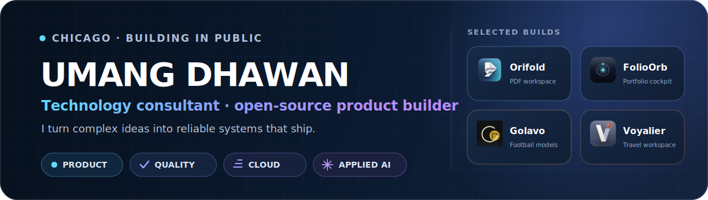

  <picture>
    <source media="(max-width: 600px)" srcset="./assets/profile-header-mobile.svg">
    
  </picture>

  
  
  
  

## I bridge strategy and engineering

I'm a **Senior Consultant at EY Studio+** in Chicago, working where product delivery, cloud reliability, quality engineering, and applied AI meet. I've helped ship a retail platform across **100+ locations**, supported a federal cloud implementation with **zero audit findings**, and built observability and release practices for enterprise teams.

Outside client work, I design and ship **local-first, open-source products** in Swift, Rust, Python, and TypeScript. I care about the parts beyond the demo: clear product decisions, trustworthy behavior, failure handling, documentation, installers, updates, and evidence that the system works.

### Impact at a glance

> 🏬 **100+ locations** — retail platform shipped 
> ✅ **Zero findings** — federal cloud audit 
> ☁️ **4 cloud products** — quality leadership 
> 🌍 **3 continents** — cross-functional delivery

## Open-source products

<table width="100%">
  <tr>
    <td valign="top">
      <h3> <a href="https://github.com/udhawan97/Orifold">Orifold</a></h3>
      
A native macOS PDF workspace for combining, OCR, editing, annotating, signing, protecting, and exporting documents — all on-device.

      
<code>Swift</code> <code>PDFKit</code> <code>PDFium</code> <code>macOS</code>

      

        <a href="https://udhawan97.github.io/Orifold/">Website</a> ·
        <a href="https://github.com/udhawan97/Orifold">Source</a> ·
        
      

    </td>
  </tr>
  <tr>
    <td valign="top">
      <h3> <a href="https://github.com/udhawan97/FolioOrb">FolioOrb</a></h3>
      
A local-first portfolio cockpit that unifies holdings, market data, risk signals, and clear actions, with deterministic analysis and optional AI narration.

      
<code>Python</code> <code>FastAPI</code> <code>SQLite</code> <code>JavaScript</code>

      

        <a href="https://udhawan97.github.io/FolioOrb/">Website</a> ·
        <a href="https://github.com/udhawan97/FolioOrb">Source</a> ·
        
      

    </td>
  </tr>
  <tr>
    <td valign="top">
      <h3> <a href="https://github.com/udhawan97/Golavo">Golavo</a></h3>
      
An auditable football forecasting workbench with sealed pre-match predictions, calibration, and cited AI explanations that never change the numbers.

      
<code>Python</code> <code>TypeScript</code> <code>Rust</code> <code>Tauri</code>

      

        <a href="https://udhawan97.github.io/Golavo/">Website</a> ·
        <a href="https://github.com/udhawan97/Golavo">Source</a> ·
        
      

    </td>
  </tr>
  <tr>
    <td valign="top">
      <h3> <a href="https://github.com/udhawan97/Voyalier">Voyalier</a></h3>
      
A local-first travel workspace that turns confirmations and sourced research into readiness actions and a reviewed, shareable trip brief.

      
<code>Rust</code> <code>TypeScript</code> <code>Tauri</code> <code>Astro</code>

      

        <a href="https://udhawan97.github.io/Voyalier/">Website</a> ·
        <a href="https://github.com/udhawan97/Voyalier">Source</a> ·
        
      

    </td>
  </tr>
</table>

## How I build

| | Principle | What it means in practice |
|---|---|---|
| 🔐 | **Local-first by default** | Keep user data on-device and make privacy a product property. |
| 🧭 | **Evidence before AI** | Deterministic systems stay authoritative; AI explains, cites, and assists. |
| 🧪 | **Quality is architecture** | Design for observability, failure modes, testability, and safe releases. |
| 📦 | **Ship the whole product** | Include docs, installers, updates, demos, and release automation — not just source. |

### Tools I reach for

  
  
  
  
  
  
  
  
  
  
  

## Experience in brief

| When | Role | Focus |
|---|---|---|
| 2025 — now | **Senior Consultant · EY Studio+** | Cloud quality leadership, observability, AI strategy, customer service transformation |
| 2022 — 2025 | **Consultant · EY** | Lead quality engineering, performance engineering, federal cloud delivery |
| 2021 | **IT Leadership Intern · SAP America** | SAFe product delivery across Germany, the US, and India |

**Education:** MS, Information Systems — Kelley School of Business · BS, Informatics — Indiana University

---

  <strong>Let's talk about trustworthy AI, local-first products, quality engineering, or turning a prototype into software people can actually use.</strong>  
  <a href="mailto:umangdhawan97@gmail.com">Email</a> ·
  <a href="https://www.linkedin.com/in/umangdhawan97">LinkedIn</a> ·
  <a href="https://udhawan97.github.io/">Portfolio &amp; case studies</a>

