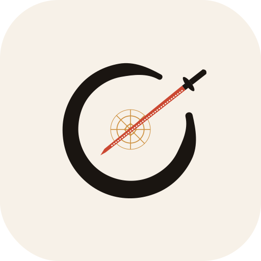

  <picture>
    <source media="(prefers-color-scheme: dark) and (max-width: 600px)" srcset="./assets/profile-header-mobile-dark.svg">
    <source media="(prefers-color-scheme: light) and (max-width: 600px)" srcset="./assets/profile-header-mobile-light.svg">
    <source media="(prefers-color-scheme: dark)" srcset="./assets/profile-header-dark.svg">
    <source media="(prefers-color-scheme: light)" srcset="./assets/profile-header-light.svg">
    
  </picture>

  <picture>
    <source media="(prefers-color-scheme: dark) and (max-width: 600px)" srcset="./assets/ai-spell-mobile-dark.svg">
    <source media="(prefers-color-scheme: light) and (max-width: 600px)" srcset="./assets/ai-spell-mobile-light.svg">
    <source media="(prefers-color-scheme: dark)" srcset="./assets/ai-spell-dark.svg">
    <source media="(prefers-color-scheme: light)" srcset="./assets/ai-spell-light.svg">
    
  </picture>

## 01 · Strategy, meet engineering

I'm a **Senior Consultant at EY Studio+** in Chicago, working where product delivery, cloud reliability, quality engineering, and applied AI meet. I've helped ship a retail platform across **100+ locations**, supported a federal cloud implementation with **zero audit findings**, and built the observability and release practices that let enterprise teams deploy without a group chat full of prayers.

Outside client work, I design and ship **open-source product systems** in Swift, Rust, Python, and TypeScript. Each starts with a messy decision or workflow — finishing a document, understanding a portfolio, preparing a trip, learning a codebase — and turns it into something people can inspect, act on, and keep. I care about the unglamorous part that starts where the demo ends: failure handling, documentation, installers, updates, and evidence that the thing actually works.

  <picture>
    <source media="(prefers-color-scheme: dark) and (max-width: 600px)" srcset="./assets/impact-seals-mobile-dark.svg">
    <source media="(prefers-color-scheme: light) and (max-width: 600px)" srcset="./assets/impact-seals-mobile-light.svg">
    <source media="(prefers-color-scheme: dark)" srcset="./assets/impact-seals-dark.svg">
    <source media="(prefers-color-scheme: light)" srcset="./assets/impact-seals-light.svg">
    
  </picture>

## 02 · Products that close the loop

Each product takes a fragmented workflow and gives it a clear end state: one finished document, a reviewable portfolio decision, a forecast with a track record, a trip-ready brief, a codebase you can explain, or a learning practice that survives the app.

<table width="100%">
  <tr>
    <td width="50%" valign="top">
      <h3 align="center"> <a href="https://github.com/udhawan97/Orifold">Orifold</a></h3>
      
A native macOS workspace that takes a pile of PDFs, scans, images, and office files through repair, organization, OCR, editing, review, signing, protection, and export — without bouncing between specialist tools.

      
<i>Fifty messy files in. One finished document out.</i>

      

        
        
        
        
      

      

        
        
        
      

    </td>
    <td width="50%" valign="top">
      <h3 align="center">
        <a href="https://github.com/udhawan97/FolioOrb"><picture>
          <source media="(prefers-color-scheme: dark)" srcset="https://github.com/udhawan97/FolioOrb/raw/main/static/img/brand/folio-orbit-mark-light-animated.svg">
          <source media="(prefers-color-scheme: light)" srcset="https://github.com/udhawan97/FolioOrb/raw/main/static/img/brand/folio-orbit-mark-dark-animated.svg">
          
        </picture></a> <a href="https://github.com/udhawan97/FolioOrb">FolioOrb</a>
      </h3>
      
A portfolio decision cockpit that combines holdings, live prices, risk math, market regime, news, and SEC context into plain Hold / Add / Trim / Exit calls, prioritized actions, and reviewable DCA steps.

      
<i>Most trackers stop at the number. FolioOrb shows what deserves attention next.</i>

      

        
        
        
        
      

      

        
        
        
      

    </td>
  </tr>
  <tr>
    <td width="50%" valign="top">
      <h3 align="center">
        <a href="https://github.com/udhawan97/Golavo"><picture>
          <source media="(prefers-color-scheme: dark)" srcset="https://github.com/udhawan97/Golavo/raw/main/assets/brand/animated/golavo-icon-dark.svg">
          <source media="(prefers-color-scheme: light)" srcset="https://github.com/udhawan97/Golavo/raw/main/assets/brand/animated/golavo-icon-light.svg">
          
        </picture></a> <a href="https://github.com/udhawan97/Golavo">Golavo</a>
      </h3>
      
An accountable football forecasting workbench where model voices show their evidence, predictions are sealed before kickoff, and results build a visible forward track record and calibration history.

      
<i>Predictions are sealed before kickoff, so hindsight can't quietly improve them.</i>

      

        
        
        
        
      

      

        
        
        
      

    </td>
    <td width="50%" valign="top">
      <h3 align="center"> <a href="https://github.com/udhawan97/Voyalier">Voyalier</a></h3>
      
A trip-readiness workspace that turns reservation evidence, official advice, weather, saved places, and traveler-authored plans into conflicts to resolve, an offline Today view, and a redacted brief worth sharing.

      
<i>Planning ends in a reviewed handoff, not seventeen open tabs.</i>

      

        
        
        
        
      

      

        
        
        
      

    </td>
  </tr>
  <tr>
    <td width="50%" valign="top">
      <h3 align="center"> <a href="https://github.com/udhawan97/Codemble">Codemble</a></h3>
      
A code-learning game that maps real Python, JavaScript, and TypeScript projects into a parser-proven galaxy, then makes learners study source, follow relationships, and pass graph-derived checks to light it up.

      
<i>It turns a codebase into a game you can win only by understanding it.</i>

      

        
        
        
        
      

      

        
        
        
      

    </td>
    <td width="50%" valign="top">
      <h3 align="center"> <a href="https://github.com/udhawan97/Dusori">Dusori</a></h3>
      
A learning workspace that turns curricula and source material into a living system: a checkable roadmap, today's next objective, durable notes, dated progress, and a knowledge graph that follows Obsidian-style links.

      
<i>Not another course catalog — a place to turn what you want to learn into a practice you can continue.</i>

      

        
        
        
        
      

      

        
        
        
        
      

    </td>
  </tr>
</table>

## 03 · How I build

| | Principle | What it means in practice |
|---|---|---|
| 🎯 | **Outcome before feature** | Start with the job someone needs to finish, then make every screen move that work forward. |
| 🧭 | **Make reasoning inspectable** | Preserve sources, calculations, provenance, and history so an answer can be challenged instead of merely trusted. |
| 🗃️ | **Users own the artifact** | Prefer durable formats, reversible changes, and deliberate sharing when the work or data is personal. |
| 🧪 | **Quality is architecture** | Design for observability, failure modes, testability, and releases that don't need a hero. |
| 📦 | **Ship the whole product** | Docs, installers, updates, demos, and release automation. Source code is the easy half. |

### Tools I reach for

  
  
  
  
  
  
  
  
  
  
  

Chosen per problem, not per hype cycle.

## 04 · Experience in brief

| When | Role | Focus |
|---|---|---|
| 2025 — now | **Senior Consultant · EY Studio+** | Cloud quality leadership · observability · applied AI strategy |
| 2022 — 2025 | **Consultant · EY** | Quality & performance engineering · federal cloud delivery |
| 2021 | **IT Leadership Intern · SAP America** | SAFe product delivery across Germany, the US, and India |

**Education:** MS, Information Systems — Kelley School of Business · BS, Informatics — Indiana University

---

  
  
  

  <strong>Let's talk about decision products, learning software, workflow design, quality engineering, or turning a prototype into software people can actually use.</strong> 
  <a href="https://udhawan97.github.io/">Portfolio &amp; case studies</a>

