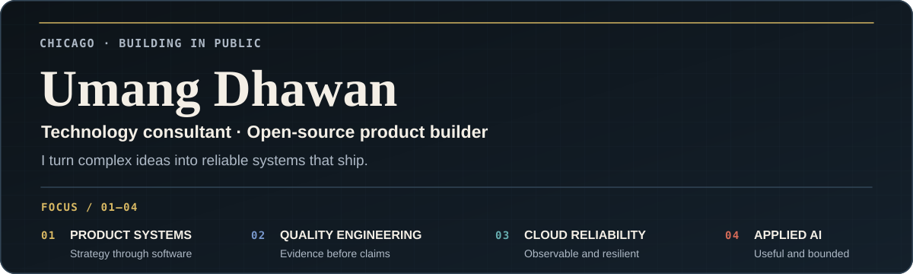
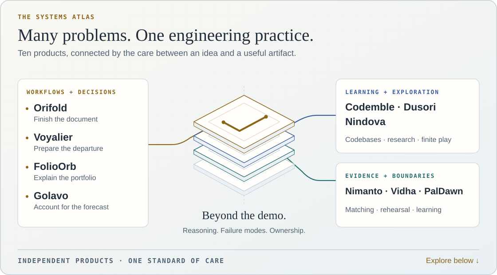
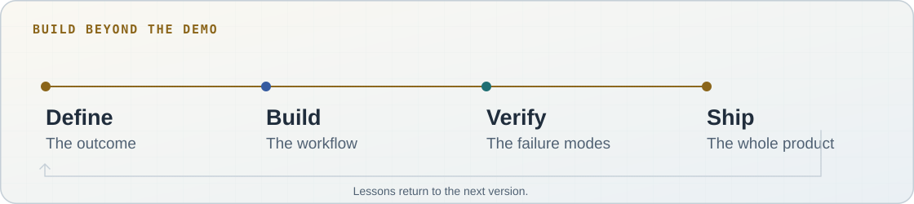
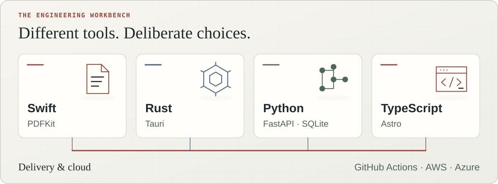
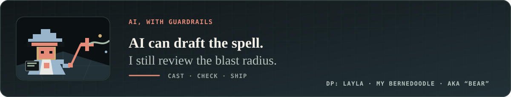

  <picture>
    <source media="(prefers-reduced-motion: reduce) and (prefers-color-scheme: dark) and (max-width: 600px)" srcset="./assets/profile-header-mobile-dark-static.svg">
    <source media="(prefers-reduced-motion: reduce) and (prefers-color-scheme: light) and (max-width: 600px)" srcset="./assets/profile-header-mobile-light-static.svg">
    <source media="(prefers-reduced-motion: reduce) and (prefers-color-scheme: dark)" srcset="./assets/profile-header-dark-static.svg">
    <source media="(prefers-reduced-motion: reduce) and (prefers-color-scheme: light)" srcset="./assets/profile-header-light-static.svg">
    <source media="(prefers-color-scheme: dark) and (max-width: 600px)" srcset="./assets/profile-header-mobile-dark.svg">
    <source media="(prefers-color-scheme: light) and (max-width: 600px)" srcset="./assets/profile-header-mobile-light.svg">
    <source media="(prefers-color-scheme: dark)" srcset="./assets/profile-header-dark.svg">
    <source media="(prefers-color-scheme: light)" srcset="./assets/profile-header-light.svg">
    
  </picture>

  <a href="https://udhawan97.github.io/"><strong>Portfolio &amp; case studies</strong></a> ·
  <a href="https://www.linkedin.com/in/umangdhawan97">LinkedIn</a> ·
  <a href="mailto:umangdhawan97@gmail.com">Email</a>

## 01 · Strategy, meet engineering

I'm **Umang**, a **Senior Consultant at EY Studio+ in Chicago**. My work connects product strategy with cloud reliability, quality engineering, and applied AI.

Outside client work, I build open-source products in **Swift, Rust, Python, and TypeScript**—from native document tools to travel planning and codebase learning. I care about the whole product: the workflow, the failure modes, and what happens after someone starts relying on it.

**Explore:** [Products](#02--products-with-a-point-of-view) · [Project links](#the-full-collection) · [Engineering approach](#03--how-i-build) · [Experience](#04--experience-in-brief)

## 02 · Products, with a point of view

<picture>
  <source media="(prefers-reduced-motion: reduce) and (prefers-color-scheme: dark) and (max-width: 700px)" srcset="./assets/profile-refresh/systems-atlas-mobile-dark-static.svg">
  <source media="(prefers-reduced-motion: reduce) and (prefers-color-scheme: light) and (max-width: 700px)" srcset="./assets/profile-refresh/systems-atlas-mobile-light-static.svg">
  <source media="(prefers-reduced-motion: reduce) and (prefers-color-scheme: dark)" srcset="./assets/profile-refresh/systems-atlas-dark-static.svg">
  <source media="(prefers-reduced-motion: reduce) and (prefers-color-scheme: light)" srcset="./assets/profile-refresh/systems-atlas-light-static.svg">
  <source media="(prefers-color-scheme: dark) and (max-width: 700px)" srcset="./assets/profile-refresh/systems-atlas-mobile-dark.svg">
  <source media="(prefers-color-scheme: light) and (max-width: 700px)" srcset="./assets/profile-refresh/systems-atlas-mobile-light.svg">
  <source media="(prefers-color-scheme: dark)" srcset="./assets/profile-refresh/systems-atlas-dark.svg">
  <source media="(prefers-color-scheme: light)" srcset="./assets/profile-refresh/systems-atlas-light.svg">
  
</picture>

### The full collection

A few places to start: **[Orifold](https://udhawan97.github.io/Orifold/)** for native Mac document workflows, **[Voyalier](https://udhawan97.github.io/Voyalier/)** for travel planning, or **[Codemble](https://udhawan97.github.io/Codemble/)** for understanding a codebase.

Open a collection for all project links and descriptions.

<strong>Workflows &amp; decisions</strong> — Orifold · Voyalier · FolioOrb · Golavo

#### <picture><source media="(prefers-reduced-motion: reduce)" srcset="./assets/profile-refresh/icons/orifold-static.svg"></picture> **[Orifold](https://udhawan97.github.io/Orifold/)**

Finish and protect documents in one native Mac workflow.

#### <picture><source media="(prefers-reduced-motion: reduce)" srcset="./assets/profile-refresh/icons/voyalier-static.svg"></picture> **[Voyalier](https://udhawan97.github.io/Voyalier/)**

Leave with a reviewed, offline-ready trip brief.

#### <picture><source media="(prefers-reduced-motion: reduce)" srcset="./assets/profile-refresh/icons/folioorb-static.svg"></picture> **[FolioOrb](https://udhawan97.github.io/FolioOrb/)**

Understand portfolio risk and reasoning with local decision support.

#### <picture><source media="(prefers-reduced-motion: reduce)" srcset="./assets/profile-refresh/icons/golavo-static.svg"></picture> **[Golavo](https://udhawan97.github.io/Golavo/)**

Inspect football forecasts and their forward track record.

<strong>Learning &amp; exploration</strong> — Codemble · Dusori · Nindova

#### <picture><source media="(prefers-reduced-motion: reduce)" srcset="./assets/profile-refresh/icons/codemble-static.svg"></picture> **[Codemble](https://udhawan97.github.io/Codemble/)**

Learn a real codebase through guided, playable challenges.

#### <picture><source media="(prefers-reduced-motion: reduce)" srcset="./assets/profile-refresh/icons/dusori-static.svg"></picture> **[Dusori](https://udhawan97.github.io/Dusori/app/)**

Turn scattered sources into cited research briefs.

#### <picture><source media="(prefers-reduced-motion: reduce)" srcset="./assets/profile-refresh/icons/nindova-static.svg"></picture> **[Nindova](https://udhawan97.github.io/Nindova/)**

Enjoy private, finite games designed to end.

<strong>Evidence &amp; boundaries</strong> — Nimanto · Vidha · PalDawn

#### <picture><source media="(prefers-reduced-motion: reduce)" srcset="./assets/profile-refresh/icons/nimanto-static.svg"></picture> **[Nimanto](https://udhawan97.github.io/Nimanto/)**

Explore job matches with evidence and candidate control.

#### <picture><source media="(prefers-reduced-motion: reduce)" srcset="./assets/profile-refresh/icons/vidha-static.svg"></picture> **[Vidha](https://github.com/udhawan97/Vidha)**

Rehearse contingency plans in a local, synthetic pre-alpha prototype.

#### <picture><source media="(prefers-reduced-motion: reduce)" srcset="./assets/profile-refresh/icons/paldawn-static.svg"></picture> **[PalDawn](https://udhawan97.github.io/PalDawn/)**

Explore source-linked disease mechanisms in conceptual 3D journeys.

## 03 · How I build

<picture>
  <source media="(prefers-reduced-motion: reduce) and (prefers-color-scheme: dark) and (max-width: 700px)" srcset="./assets/profile-refresh/delivery-loop-mobile-dark-static.svg">
  <source media="(prefers-reduced-motion: reduce) and (prefers-color-scheme: light) and (max-width: 700px)" srcset="./assets/profile-refresh/delivery-loop-mobile-light-static.svg">
  <source media="(prefers-reduced-motion: reduce) and (prefers-color-scheme: dark)" srcset="./assets/profile-refresh/delivery-loop-dark-static.svg">
  <source media="(prefers-reduced-motion: reduce) and (prefers-color-scheme: light)" srcset="./assets/profile-refresh/delivery-loop-light-static.svg">
  <source media="(prefers-color-scheme: dark) and (max-width: 700px)" srcset="./assets/profile-refresh/delivery-loop-mobile-dark.svg">
  <source media="(prefers-color-scheme: light) and (max-width: 700px)" srcset="./assets/profile-refresh/delivery-loop-mobile-light.svg">
  <source media="(prefers-color-scheme: dark)" srcset="./assets/profile-refresh/delivery-loop-dark.svg">
  <source media="(prefers-color-scheme: light)" srcset="./assets/profile-refresh/delivery-loop-light.svg">
  
</picture>

- **Start with the job.** Make every feature earn its place in a workflow someone needs to finish.
- **Show the reasoning.** Keep sources, calculations, and history close enough to inspect and challenge.
- **Preserve ownership.** Prefer durable files, reversible changes, and deliberate sharing.
- **Design for the difficult parts.** Treat failure handling, observability, documentation, and updates as product work.

### Working stack

<picture>
  <source media="(prefers-reduced-motion: reduce) and (prefers-color-scheme: dark) and (max-width: 700px)" srcset="./assets/profile-refresh/engineering-workbench-mobile-dark-static.svg">
  <source media="(prefers-reduced-motion: reduce) and (prefers-color-scheme: light) and (max-width: 700px)" srcset="./assets/profile-refresh/engineering-workbench-mobile-light-static.svg">
  <source media="(prefers-reduced-motion: reduce) and (prefers-color-scheme: dark)" srcset="./assets/profile-refresh/engineering-workbench-dark-static.svg">
  <source media="(prefers-reduced-motion: reduce) and (prefers-color-scheme: light)" srcset="./assets/profile-refresh/engineering-workbench-light-static.svg">
  <source media="(prefers-color-scheme: dark) and (max-width: 700px)" srcset="./assets/profile-refresh/engineering-workbench-mobile-dark.svg">
  <source media="(prefers-color-scheme: light) and (max-width: 700px)" srcset="./assets/profile-refresh/engineering-workbench-mobile-light.svg">
  <source media="(prefers-color-scheme: dark)" srcset="./assets/profile-refresh/engineering-workbench-dark.svg">
  <source media="(prefers-color-scheme: light)" srcset="./assets/profile-refresh/engineering-workbench-light.svg">
  
</picture>

  <picture>
    <source media="(prefers-reduced-motion: reduce) and (prefers-color-scheme: dark) and (max-width: 600px)" srcset="./assets/ai-spell-mobile-dark-static.svg">
    <source media="(prefers-reduced-motion: reduce) and (prefers-color-scheme: light) and (max-width: 600px)" srcset="./assets/ai-spell-mobile-light-static.svg">
    <source media="(prefers-reduced-motion: reduce) and (prefers-color-scheme: dark)" srcset="./assets/ai-spell-dark-static.svg">
    <source media="(prefers-reduced-motion: reduce) and (prefers-color-scheme: light)" srcset="./assets/ai-spell-light-static.svg">
    <source media="(prefers-color-scheme: dark) and (max-width: 600px)" srcset="./assets/ai-spell-mobile-dark.svg">
    <source media="(prefers-color-scheme: light) and (max-width: 600px)" srcset="./assets/ai-spell-mobile-light.svg">
    <source media="(prefers-color-scheme: dark)" srcset="./assets/ai-spell-dark.svg">
    <source media="(prefers-color-scheme: light)" srcset="./assets/ai-spell-light.svg">
    
  </picture>

### Reusable agent workflows

**[Agent Toolkit](https://github.com/udhawan97/agent-toolkit)** is the reusable tooling behind my agent-assisted development: technical-debt review, user-flow review, and council review, packaged for Codex and Claude Code. Each workflow has explicit ownership and cleanup boundaries.

[Setup and documentation](https://github.com/udhawan97/agent-toolkit#readme) · [Validation workflow](https://github.com/udhawan97/agent-toolkit/actions/workflows/validate.yml)

Agent Toolkit · architecture and operating boundaries

A canonical skill payload keeps the owned workflows aligned across clients. Native manifests preserve each client's discovery, permissions, and authentication. Setup records the state it owns so updates and removal can remain scoped.

## 04 · Experience in brief

My consulting work spans enterprise product delivery, federal cloud implementation, and quality leadership across distributed teams.

  <picture>
    <source media="(prefers-reduced-motion: reduce) and (prefers-color-scheme: dark) and (max-width: 600px)" srcset="./assets/impact-seals-mobile-dark-static.svg">
    <source media="(prefers-reduced-motion: reduce) and (prefers-color-scheme: light) and (max-width: 600px)" srcset="./assets/impact-seals-mobile-light-static.svg">
    <source media="(prefers-reduced-motion: reduce) and (prefers-color-scheme: dark)" srcset="./assets/impact-seals-dark-static.svg">
    <source media="(prefers-reduced-motion: reduce) and (prefers-color-scheme: light)" srcset="./assets/impact-seals-light-static.svg">
    <source media="(prefers-color-scheme: dark) and (max-width: 600px)" srcset="./assets/impact-seals-mobile-dark.svg">
    <source media="(prefers-color-scheme: light) and (max-width: 600px)" srcset="./assets/impact-seals-mobile-light.svg">
    <source media="(prefers-color-scheme: dark)" srcset="./assets/impact-seals-dark.svg">
    <source media="(prefers-color-scheme: light)" srcset="./assets/impact-seals-light.svg">
    
  </picture>

**Senior Consultant · EY Studio+ · 2025 — now** 
Cloud quality leadership · observability · applied AI strategy

**Consultant · EY · 2022 — 2025** 
Quality and performance engineering · federal cloud delivery

**IT Leadership Intern · SAP America · 2021** 
SAFe product delivery across Germany, the US, and India

**Education** 
MS, Information Systems — Kelley School of Business 
BS, Informatics — Indiana University

Repository activity · supporting context

Commit counts describe repository activity, not product quality or adoption. The badges below are provided by Shields and can be cached. Follow a badge to inspect the actual history.

---

### Have a difficult workflow in mind?

Let's talk about the product it could become—and the engineering it would take to make it dependable.

[Portfolio & case studies](https://udhawan97.github.io/) · [LinkedIn](https://www.linkedin.com/in/umangdhawan97) · [Email](mailto:umangdhawan97@gmail.com)
