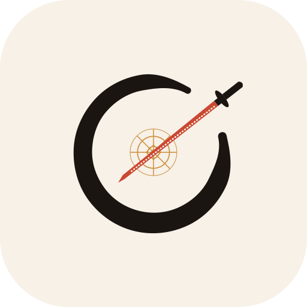

<!-- Hallmark · pre-emit critique: P5 H5 E5 S5 R5 V4 -->

  <picture>
    <source media="(prefers-color-scheme: dark) and (max-width: 600px)" srcset="./assets/profile-header-mobile-dark.svg">
    <source media="(prefers-color-scheme: light) and (max-width: 600px)" srcset="./assets/profile-header-mobile-light.svg">
    <source media="(prefers-color-scheme: dark)" srcset="./assets/profile-header-dark.svg">
    <source media="(prefers-color-scheme: light)" srcset="./assets/profile-header-light.svg">
    
  </picture>

  <picture>
    <source media="(prefers-color-scheme: dark) and (max-width: 600px)" srcset="./assets/ai-spell-mobile-dark.svg">
    <source media="(prefers-color-scheme: light) and (max-width: 600px)" srcset="./assets/ai-spell-mobile-light.svg">
    <source media="(prefers-color-scheme: dark)" srcset="./assets/ai-spell-dark.svg">
    <source media="(prefers-color-scheme: light)" srcset="./assets/ai-spell-light.svg">
    
  </picture>

## 01 · Strategy, meet engineering

I'm a **Senior Consultant at EY Studio+** in Chicago, working where product delivery, cloud reliability, quality engineering, and applied AI meet. I've helped ship a retail platform across **100+ locations**, supported a federal cloud implementation with **zero audit findings**, and built the observability and release practices that let enterprise teams deploy without a group chat full of prayers.

Outside client work, I design and ship **open-source product systems** in Swift, Rust, Python, and TypeScript. Each starts with a messy decision or workflow — finishing a document, understanding a portfolio, preparing a trip, learning a codebase — and turns it into something people can inspect, act on, and keep. I care about the unglamorous part that starts where the demo ends: failure handling, documentation, installers, updates, and evidence that the thing actually works.

  <picture>
    <source media="(prefers-color-scheme: dark) and (max-width: 600px)" srcset="./assets/impact-seals-mobile-dark.svg">
    <source media="(prefers-color-scheme: light) and (max-width: 600px)" srcset="./assets/impact-seals-mobile-light.svg">
    <source media="(prefers-color-scheme: dark)" srcset="./assets/impact-seals-dark.svg">
    <source media="(prefers-color-scheme: light)" srcset="./assets/impact-seals-light.svg">
    
  </picture>

## 02 · Products, at a glance

Ten products—each distilled to what it delivers, the problem it solves, and why it stands apart.

<!-- Hallmark · genre: modern-minimal · macrostructure: Index-First · theme: Cobalt · enrichment: product marks -->

<h3>&nbsp;&nbsp;<a href="https://udhawan97.github.io/Orifold/">Orifold</a></h3>

<strong>Value</strong> Produces finished, protected documents from mixed files in one native Mac workflow.

<strong>Problem solved</strong> PDF work splinters across repair, OCR, editing, signing, and export tools.

<strong>Different</strong> Keeps the entire document lifecycle local instead of stitching together specialist apps or cloud uploads.

---

<h3>&nbsp;&nbsp;<a href="https://udhawan97.github.io/FolioOrb/">FolioOrb</a></h3>

<strong>Value</strong> Turns holdings, market data, and risk context into explainable portfolio decision support.

<strong>Problem solved</strong> It is hard to tell what deserves attention when holdings, risk, news, and market context are scattered.

<strong>Different</strong> Keeps data and reasoning local, shows its evidence, and never connects to a brokerage or places trades.

---

<h3>&nbsp;&nbsp;<a href="https://udhawan97.github.io/PalDawn/">PalDawn</a></h3>

<strong>Value</strong> Presents complex disease mechanisms as source-linked journeys through an interactive conceptual 3D map.

<strong>Problem solved</strong> Cause and effect across multiple body systems is hard to follow when structure and explanation live separately.

<strong>Different</strong> Synchronizes causal phases, system highlights, plain or clinical depth, and direct sources while explicitly bounding unreviewed synthesis.

---

<h3><a href="https://github.com/udhawan97/Vidha"><picture><source media="(prefers-color-scheme: dark)" srcset="https://github.com/udhawan97/Vidha/raw/main/apps/web/public/vidha-mark-reversed.svg"><source media="(prefers-color-scheme: light)" srcset="https://github.com/udhawan97/Vidha/raw/main/apps/web/public/vidha-mark.svg"></picture></a>&nbsp;&nbsp;<a href="https://github.com/udhawan97/Vidha">Vidha</a></h3>

<strong>Value</strong> Lets people locally rehearse who should receive which documents, and when, without releasing anything; currently pre-alpha.

<strong>Problem solved</strong> A contingency plan must handle prolonged silence without confusing it with proof, an emergency, or permission to release.

<strong>Different</strong> A missed Check-in enters reversible Concern—not a conclusion; human verification, holds, vetoes, and Release remain planned.

---

<h3><a href="https://github.com/udhawan97/Golavo"><picture><source media="(prefers-color-scheme: dark)" srcset="https://github.com/udhawan97/Golavo/raw/main/assets/brand/animated/golavo-icon-dark.svg"><source media="(prefers-color-scheme: light)" srcset="https://github.com/udhawan97/Golavo/raw/main/assets/brand/animated/golavo-icon-light.svg"></picture></a>&nbsp;&nbsp;<a href="https://udhawan97.github.io/Golavo/">Golavo</a></h3>

<strong>Value</strong> Makes football forecasts accountable through pre-match predictions and a visible calibration history.

<strong>Problem solved</strong> Forecast quality is hard to judge when past calls can be rewritten or selectively remembered.

<strong>Different</strong> Seals forecasts before kickoff and scores the track record forward, so hindsight cannot edit the story.

---

<h3>&nbsp;&nbsp;<a href="https://udhawan97.github.io/Voyalier/">Voyalier</a></h3>

<strong>Value</strong> Produces an offline-ready, shareable trip brief from reservations, official advice, weather, places, and plans.

<strong>Problem solved</strong> Critical travel details stay fragmented across tabs, inboxes, and single-purpose apps.

<strong>Different</strong> Optimizes for a reviewed departure artifact—not another itinerary builder or booking feed.

---

<h3>&nbsp;&nbsp;<a href="https://udhawan97.github.io/Codemble/">Codemble</a></h3>

<strong>Value</strong> Turns a real codebase into a playable learning map grounded in parser-verified structure.

<strong>Problem solved</strong> Unfamiliar codebases are hard to learn when tutorials and diagrams drift from the real source.

<strong>Different</strong> Progress comes from proving understanding of actual files and relationships—not completing canned exercises.

---

<h3>&nbsp;&nbsp;<a href="https://udhawan97.github.io/Dusori/app/">Dusori</a></h3>

<strong>Value</strong> Turns a hard question into a cited research brief with a durable evidence trail.

<strong>Problem solved</strong> Search, reading, notes, and synthesis fragment across tabs and files, making claims hard to audit.

<strong>Different</strong> Searches only permitted sources, preserves failures and gaps, and stores ordinary local files—AI optional.

---

<h3><a href="https://github.com/udhawan97/Nindova"><picture><source media="(prefers-color-scheme: light)" srcset="https://github.com/udhawan97/Nindova/raw/main/apps/site/public/brand/nindova-mark-light.svg"></picture></a>&nbsp;&nbsp;<a href="https://udhawan97.github.io/Nindova/">Nindova</a></h3>

<strong>Value</strong> Offers eight finite authored games and a separate self-ending wind-down session for private, offline play.

<strong>Problem solved</strong> Many digital games are designed around endless engagement, tracking, rankings, and return loops.

<strong>Different</strong> Every experience has a curtain call—no account, ads, telemetry, public leaderboard, or game that refuses to end.

---

<h3>&nbsp;&nbsp;<a href="https://udhawan97.github.io/Nimanto/">Nimanto</a></h3>

<strong>Value</strong> Turns candidate-confirmed evidence and allowlisted roles into reviewable job matches and application packets.

<strong>Problem solved</strong> Job-search automation can invent qualifications or act before candidates approve the story.

<strong>Different</strong> Uses confirmed evidence only, separates packet and action approval, and keeps external handoff disabled by default.

## 03 · How I build

| | Principle | What it means in practice |
|---|---|---|
| 🎯 | **Outcome before feature** | Start with the job someone needs to finish, then make every screen move that work forward. |
| 🧭 | **Make reasoning inspectable** | Preserve sources, calculations, provenance, and history so an answer can be challenged instead of merely trusted. |
| 🗃️ | **Users own the artifact** | Prefer durable formats, reversible changes, and deliberate sharing when the work or data is personal. |
| 🧪 | **Quality is architecture** | Design for observability, failure modes, testability, and releases that don't need a hero. |
| 📦 | **Ship the whole product** | Docs, installers, updates, demos, and release automation. Source code is the easy half. |

### Tools I reach for

  
  
  
  
  
  
  
  
  
  
  

Chosen per problem, not per hype cycle.

## 04 · Experience in brief

| When | Role | Focus |
|---|---|---|
| 2025 — now | **Senior Consultant · EY Studio+** | Cloud quality leadership · observability · applied AI strategy |
| 2022 — 2025 | **Consultant · EY** | Quality & performance engineering · federal cloud delivery |
| 2021 | **IT Leadership Intern · SAP America** | SAFe product delivery across Germany, the US, and India |

**Education:** MS, Information Systems — Kelley School of Business · BS, Informatics — Indiana University

---

  
  
  

  <strong>Let's talk about decision products, learning software, workflow design, quality engineering, or turning a prototype into software people can actually use.</strong> 
  <a href="https://udhawan97.github.io/">Portfolio &amp; case studies</a>

