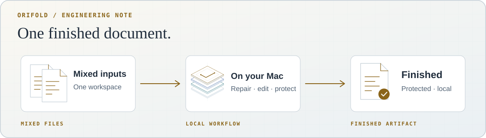
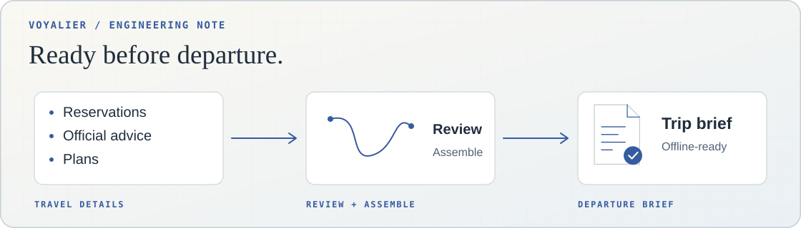
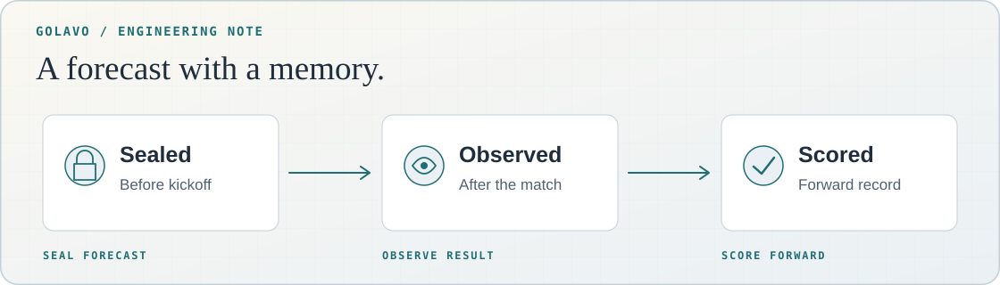

  <picture>
    <source media="(prefers-color-scheme: dark) and (max-width: 600px)" srcset="./assets/profile-header-mobile-dark.svg">
    <source media="(prefers-color-scheme: light) and (max-width: 600px)" srcset="./assets/profile-header-mobile-light.svg">
    <source media="(prefers-color-scheme: dark)" srcset="./assets/profile-header-dark.svg">
    <source media="(prefers-color-scheme: light)" srcset="./assets/profile-header-light.svg">
    
  </picture>

  <picture>
    <source media="(prefers-color-scheme: dark) and (max-width: 600px)" srcset="./assets/ai-spell-mobile-dark.svg">
    <source media="(prefers-color-scheme: light) and (max-width: 600px)" srcset="./assets/ai-spell-mobile-light.svg">
    <source media="(prefers-color-scheme: dark)" srcset="./assets/ai-spell-dark.svg">
    <source media="(prefers-color-scheme: light)" srcset="./assets/ai-spell-light.svg">
    
  </picture>

  <a href="https://udhawan97.github.io/"><strong>Portfolio &amp; case studies</strong></a> ·
  <a href="https://www.linkedin.com/in/umangdhawan97">LinkedIn</a> ·
  <a href="mailto:umangdhawan97@gmail.com">Email</a>

## 01 · Strategy, meet engineering

I'm a **Senior Consultant at EY Studio+ in Chicago**, working across product delivery, cloud reliability, quality engineering, and applied AI.

Outside client work, I build **open-source products in Swift, Rust, Python, and TypeScript**. I turn fragmented workflows into software people can use, inspect, and keep. The work includes what comes after the demo: failure handling, documentation, installers, updates, and evidence that the product works.

**Explore:** [Selected builds](#selected-builds) · [Full collection](#the-full-collection) · [How I build](#03--how-i-build) · [Experience](#04--experience-in-brief)

## 02 · Products, with a point of view

<picture>
  <source media="(prefers-reduced-motion: reduce) and (prefers-color-scheme: dark) and (max-width: 700px)" srcset="./assets/profile-refresh/systems-atlas-mobile-dark-static.svg">
  <source media="(prefers-reduced-motion: reduce) and (prefers-color-scheme: light) and (max-width: 700px)" srcset="./assets/profile-refresh/systems-atlas-mobile-light-static.svg">
  <source media="(prefers-reduced-motion: reduce) and (prefers-color-scheme: dark)" srcset="./assets/profile-refresh/systems-atlas-dark-static.svg">
  <source media="(prefers-reduced-motion: reduce) and (prefers-color-scheme: light)" srcset="./assets/profile-refresh/systems-atlas-light-static.svg">
  <source media="(prefers-color-scheme: dark) and (max-width: 700px)" srcset="./assets/profile-refresh/systems-atlas-mobile-dark.svg">
  <source media="(prefers-color-scheme: light) and (max-width: 700px)" srcset="./assets/profile-refresh/systems-atlas-mobile-light.svg">
  <source media="(prefers-color-scheme: dark)" srcset="./assets/profile-refresh/systems-atlas-dark.svg">
  <source media="(prefers-color-scheme: light)" srcset="./assets/profile-refresh/systems-atlas-light.svg">
  
</picture>

### Selected builds

Three entry points into my work: a native document application, a cross-platform travel workspace, and a forecasting system with an inspectable record. Project scope and release maturity are documented in each repository.

<h4><picture><source media="(prefers-reduced-motion: reduce)" srcset="./assets/profile-refresh/icons/orifold-static.svg"></picture>&nbsp; Orifold</h4>

**Finish the document. Keep the workflow local.**

A native Mac workspace for assembling, editing, OCR, signing, and protecting documents.

**Engineering focus:** preserve the document through the workflow with local processing, deliberate edits, and validation after export.

Swift · PDFKit · PDFium · macOS

[Explore](https://udhawan97.github.io/Orifold/) · [Source](https://github.com/udhawan97/Orifold) · [Release notes](https://github.com/udhawan97/Orifold/releases)

Inside Orifold · workflow and design choices

<picture>
  <source media="(prefers-color-scheme: dark) and (max-width: 700px)" srcset="./assets/profile-refresh/orifold-cutaway-mobile-dark.svg">
  <source media="(prefers-color-scheme: light) and (max-width: 700px)" srcset="./assets/profile-refresh/orifold-cutaway-mobile-light.svg">
  <source media="(prefers-color-scheme: dark)" srcset="./assets/profile-refresh/orifold-cutaway-dark.svg">
  <source media="(prefers-color-scheme: light)" srcset="./assets/profile-refresh/orifold-cutaway-light.svg">
  
</picture>

**The problem:** PDF work splinters across repair, OCR, editing, signing, and export tools.

**The engineering choice:** Keeps the entire document lifecycle local instead of stitching together specialist apps or cloud uploads.

<h4><picture><source media="(prefers-reduced-motion: reduce)" srcset="./assets/profile-refresh/icons/voyalier-static.svg"></picture>&nbsp; Voyalier</h4>

**Turn travel research into a departure artifact.**

A desktop travel workspace that brings reservations, official advice, places, and plans into a reviewed, offline-ready brief.

**Engineering focus:** keep the boundary between saved evidence and live information explicit; keep sources and dates visible, and make the useful artifact travel with you.

Rust · TypeScript · Tauri · Astro

[Explore](https://udhawan97.github.io/Voyalier/) · [Source](https://github.com/udhawan97/Voyalier) · [Release notes](https://github.com/udhawan97/Voyalier/releases)

Inside Voyalier · workflow and design choices

<picture>
  <source media="(prefers-color-scheme: dark) and (max-width: 700px)" srcset="./assets/profile-refresh/voyalier-cutaway-mobile-dark.svg">
  <source media="(prefers-color-scheme: light) and (max-width: 700px)" srcset="./assets/profile-refresh/voyalier-cutaway-mobile-light.svg">
  <source media="(prefers-color-scheme: dark)" srcset="./assets/profile-refresh/voyalier-cutaway-dark.svg">
  <source media="(prefers-color-scheme: light)" srcset="./assets/profile-refresh/voyalier-cutaway-light.svg">
  
</picture>

**The problem:** Critical travel details stay fragmented across tabs, inboxes, and single-purpose apps.

**The engineering choice:** Optimizes for a reviewed departure artifact—not another itinerary builder or booking feed.

<h4><picture><source media="(prefers-reduced-motion: reduce)" srcset="./assets/profile-refresh/icons/golavo-static.svg"></picture>&nbsp; Golavo</h4>

**Make the forecast answer to the record.**

A pre-alpha football analysis desktop app with forecasts sealed before kickoff and a track record scored forward.

**Engineering focus:** resist hindsight; preserve the original claim, score outcomes separately, and make uncertainty and unavailable evidence visible.

Python · TypeScript · Rust · Tauri

[Explore](https://udhawan97.github.io/Golavo/) · [Source](https://github.com/udhawan97/Golavo) · [Release notes](https://github.com/udhawan97/Golavo/releases)

Inside Golavo · workflow and design choices

<picture>
  <source media="(prefers-color-scheme: dark) and (max-width: 700px)" srcset="./assets/profile-refresh/golavo-cutaway-mobile-dark.svg">
  <source media="(prefers-color-scheme: light) and (max-width: 700px)" srcset="./assets/profile-refresh/golavo-cutaway-mobile-light.svg">
  <source media="(prefers-color-scheme: dark)" srcset="./assets/profile-refresh/golavo-cutaway-dark.svg">
  <source media="(prefers-color-scheme: light)" srcset="./assets/profile-refresh/golavo-cutaway-light.svg">
  
</picture>

**The problem:** Forecast quality is hard to judge when past calls can be rewritten or selectively remembered.

**The engineering choice:** Seals forecasts before kickoff and scores the track record forward, so hindsight cannot edit the story.

### The full collection

| Product | The job it helps someone finish |
| :--- | :--- |
| <picture><source media="(prefers-reduced-motion: reduce)" srcset="./assets/profile-refresh/icons/orifold-static.svg"></picture> **[Orifold](https://udhawan97.github.io/Orifold/)** | Finish and protect documents in one native Mac workflow. |
| <picture><source media="(prefers-reduced-motion: reduce)" srcset="./assets/profile-refresh/icons/voyalier-static.svg"></picture> **[Voyalier](https://udhawan97.github.io/Voyalier/)** | Leave with a reviewed, offline-ready trip brief. |
| <picture><source media="(prefers-reduced-motion: reduce)" srcset="./assets/profile-refresh/icons/folioorb-static.svg"></picture> **[FolioOrb](https://udhawan97.github.io/FolioOrb/)** | Understand portfolio risk and reasoning with local decision support. |
| <picture><source media="(prefers-reduced-motion: reduce)" srcset="./assets/profile-refresh/icons/golavo-static.svg"></picture> **[Golavo](https://udhawan97.github.io/Golavo/)** | Inspect football forecasts and their forward track record. |
| <picture><source media="(prefers-reduced-motion: reduce)" srcset="./assets/profile-refresh/icons/codemble-static.svg"></picture> **[Codemble](https://udhawan97.github.io/Codemble/)** | Learn a real codebase through guided, playable challenges. |
| <picture><source media="(prefers-reduced-motion: reduce)" srcset="./assets/profile-refresh/icons/dusori-static.svg"></picture> **[Dusori](https://udhawan97.github.io/Dusori/app/)** | Turn scattered sources into cited research briefs. |
| <picture><source media="(prefers-reduced-motion: reduce)" srcset="./assets/profile-refresh/icons/nindova-static.svg"></picture> **[Nindova](https://udhawan97.github.io/Nindova/)** | Enjoy private, finite games designed to end. |
| <picture><source media="(prefers-reduced-motion: reduce)" srcset="./assets/profile-refresh/icons/nimanto-static.svg"></picture> **[Nimanto](https://udhawan97.github.io/Nimanto/)** | Explore job matches with evidence and candidate control. |
| <picture><source media="(prefers-reduced-motion: reduce)" srcset="./assets/profile-refresh/icons/vidha-static.svg"></picture> **[Vidha](https://github.com/udhawan97/Vidha)** | Rehearse contingency plans in a local, synthetic pre-alpha prototype. |
| <picture><source media="(prefers-reduced-motion: reduce)" srcset="./assets/profile-refresh/icons/paldawn-static.svg"></picture> **[PalDawn](https://udhawan97.github.io/PalDawn/)** | Explore source-linked disease mechanisms in conceptual 3D journeys. |

<strong>Portfolio decisions</strong> · FolioOrb

<h3><picture><source media="(prefers-reduced-motion: reduce)" srcset="./assets/profile-refresh/icons/folioorb-static.svg"></picture>&nbsp; FolioOrb</h3>

Turns holdings, market data, and risk context into explainable portfolio decision support.

**The problem:** It is hard to tell what deserves attention when holdings, risk, news, and market context are scattered.

**The engineering choice:** Keeps data and reasoning local, shows its evidence, and never connects to a brokerage or places trades.

Python · FastAPI · SQLite · JavaScript

[Explore](https://udhawan97.github.io/FolioOrb/) · [Source](https://github.com/udhawan97/FolioOrb) · [Release notes](https://github.com/udhawan97/FolioOrb/releases)

<strong>Learning, research &amp; finite play</strong> · Codemble, Dusori, Nindova

<h3><picture><source media="(prefers-reduced-motion: reduce)" srcset="./assets/profile-refresh/icons/codemble-static.svg"></picture>&nbsp; Codemble</h3>

Turns a real codebase into a playable learning map grounded in parser-verified structure.

**The problem:** Unfamiliar codebases are hard to learn when tutorials and diagrams drift from the real source.

**The engineering choice:** Progress comes from proving understanding of actual files and relationships—not completing canned exercises.

Python · JavaScript · TypeScript · Astro

[Explore](https://udhawan97.github.io/Codemble/) · [Source](https://github.com/udhawan97/Codemble) · [Release notes](https://github.com/udhawan97/Codemble/releases)

<h3><picture><source media="(prefers-reduced-motion: reduce)" srcset="./assets/profile-refresh/icons/dusori-static.svg"></picture>&nbsp; Dusori</h3>

Turns a hard question into a cited research brief with a durable evidence trail.

**The problem:** Search, reading, notes, and synthesis fragment across tabs and files, making claims hard to audit.

**The engineering choice:** Searches only permitted sources, preserves failures and gaps, and stores ordinary local files—AI optional.

TypeScript · Svelte · Rust · Tauri

[Explore](https://udhawan97.github.io/Dusori/app/) · [Source](https://github.com/udhawan97/Dusori) · [Release notes](https://github.com/udhawan97/Dusori/releases)

<h3><picture><source media="(prefers-reduced-motion: reduce)" srcset="./assets/profile-refresh/icons/nindova-static.svg"></picture>&nbsp; Nindova</h3>

Offers eight finite authored games and a separate self-ending wind-down session for private, offline play.

**The problem:** Many digital games are designed around endless engagement, tracking, rankings, and return loops.

**The engineering choice:** Every experience has a curtain call—no account, ads, telemetry, public leaderboard, or game that refuses to end.

TypeScript · Vite · Astro · Progressive web app

[Explore](https://udhawan97.github.io/Nindova/) · [Source](https://github.com/udhawan97/Nindova) · [Release notes](https://github.com/udhawan97/Nindova/releases)

<strong>Evidence &amp; deliberate boundaries</strong> · Nimanto, Vidha, PalDawn

<h3><picture><source media="(prefers-reduced-motion: reduce)" srcset="./assets/profile-refresh/icons/nimanto-static.svg"></picture>&nbsp; Nimanto</h3>

Turns candidate-confirmed evidence and allowlisted roles into reviewable job matches and application packets.

**The problem:** Job-search automation can invent qualifications or act before candidates approve the story.

**The engineering choice:** Uses confirmed evidence only, separates packet and action approval, and keeps external handoff disabled by default.

TypeScript · Next.js · Fastify · PGlite

[Explore](https://udhawan97.github.io/Nimanto/) · [Source](https://github.com/udhawan97/Nimanto) · [Release notes](https://github.com/udhawan97/Nimanto/releases)

<h3><picture><source media="(prefers-reduced-motion: reduce)" srcset="./assets/profile-refresh/icons/vidha-static.svg"></picture>&nbsp; Vidha</h3>

Lets people locally rehearse who should receive which documents, and when, without releasing anything; currently pre-alpha.

**The problem:** A contingency plan must handle prolonged silence without confusing it with proof, an emergency, or permission to release.

**The engineering choice:** A missed Check-in enters reversible Concern—not a conclusion; human verification, holds, vetoes, and Release remain planned.

TypeScript · React · Vite · PostgreSQL

[Explore](https://github.com/udhawan97/Vidha) · [Source](https://github.com/udhawan97/Vidha)

<h3><picture><source media="(prefers-reduced-motion: reduce)" srcset="./assets/profile-refresh/icons/paldawn-static.svg"></picture>&nbsp; PalDawn</h3>

Presents complex disease mechanisms as source-linked journeys through an interactive conceptual 3D map.

**The problem:** Cause and effect across multiple body systems is hard to follow when structure and explanation live separately.

**The engineering choice:** Synchronizes causal phases, system highlights, plain or clinical depth, and direct sources while explicitly bounding unreviewed synthesis.

TypeScript · React · Three.js · Vite

[Explore](https://udhawan97.github.io/PalDawn/) · [Source](https://github.com/udhawan97/PalDawn) · [Release notes](https://github.com/udhawan97/PalDawn/releases)

## 03 · How I build

<picture>
  <source media="(prefers-reduced-motion: reduce) and (prefers-color-scheme: dark) and (max-width: 700px)" srcset="./assets/profile-refresh/delivery-loop-mobile-dark-static.svg">
  <source media="(prefers-reduced-motion: reduce) and (prefers-color-scheme: light) and (max-width: 700px)" srcset="./assets/profile-refresh/delivery-loop-mobile-light-static.svg">
  <source media="(prefers-reduced-motion: reduce) and (prefers-color-scheme: dark)" srcset="./assets/profile-refresh/delivery-loop-dark-static.svg">
  <source media="(prefers-reduced-motion: reduce) and (prefers-color-scheme: light)" srcset="./assets/profile-refresh/delivery-loop-light-static.svg">
  <source media="(prefers-color-scheme: dark) and (max-width: 700px)" srcset="./assets/profile-refresh/delivery-loop-mobile-dark.svg">
  <source media="(prefers-color-scheme: light) and (max-width: 700px)" srcset="./assets/profile-refresh/delivery-loop-mobile-light.svg">
  <source media="(prefers-color-scheme: dark)" srcset="./assets/profile-refresh/delivery-loop-dark.svg">
  <source media="(prefers-color-scheme: light)" srcset="./assets/profile-refresh/delivery-loop-light.svg">
  
</picture>

- **Start with a job someone needs to finish.** Make each feature earn its place in that workflow.
- **Make reasoning inspectable.** Preserve sources, calculations, provenance, and history so an answer can be challenged.
- **Keep ownership with the user.** Favor durable artifacts, reversible changes, and deliberate sharing.
- **Treat quality as architecture.** Design for observability, failure modes, testability, and the full release lifecycle.

### The tooling behind the work

**[Agent Toolkit](https://github.com/udhawan97/agent-toolkit)** packages my agent workflows for Codex and Claude Code through their native plugin systems. Its three owned workflows cover technical debt, user-flow design review, and council review, with explicit ownership and cleanup boundaries.

[Setup and documentation](https://github.com/udhawan97/agent-toolkit#readme) · [Validation workflow](https://github.com/udhawan97/agent-toolkit/actions/workflows/validate.yml)

Agent Toolkit · architecture and operating boundaries

A canonical skill payload keeps the owned workflows aligned across clients. Native manifests preserve each client's discovery, permissions, and authentication. Setup records the state it owns so updates and removal can remain scoped.

**Languages:** Swift · Rust · Python · TypeScript 
**Product foundations:** PDFKit · Tauri · FastAPI · SQLite · Astro 
**Delivery and cloud:** GitHub Actions · AWS · Azure

## 04 · Experience in brief

I've helped ship a retail platform across **100+ locations**, supported a federal cloud implementation with **zero audit findings**, and led work across quality engineering, observability, and release practices.

  <picture>
    <source media="(prefers-color-scheme: dark) and (max-width: 600px)" srcset="./assets/impact-seals-mobile-dark.svg">
    <source media="(prefers-color-scheme: light) and (max-width: 600px)" srcset="./assets/impact-seals-mobile-light.svg">
    <source media="(prefers-color-scheme: dark)" srcset="./assets/impact-seals-dark.svg">
    <source media="(prefers-color-scheme: light)" srcset="./assets/impact-seals-light.svg">
    
  </picture>

**Senior Consultant · EY Studio+ · 2025 — now** 
Cloud quality leadership · observability · applied AI strategy

**Consultant · EY · 2022 — 2025** 
Quality and performance engineering · federal cloud delivery

**IT Leadership Intern · SAP America · 2021** 
SAFe product delivery across Germany, the US, and India

**Education:** MS, Information Systems — Kelley School of Business · BS, Informatics — Indiana University

Repository activity · supporting context

Commit counts describe repository activity, not product quality or adoption. The badges below are provided by Shields and can be cached. Follow a badge to inspect the actual history.

---

**Let's talk about useful software and the engineering that makes it dependable.**

[Portfolio & case studies](https://udhawan97.github.io/) · [LinkedIn](https://www.linkedin.com/in/umangdhawan97) · [Email](mailto:umangdhawan97@gmail.com)
